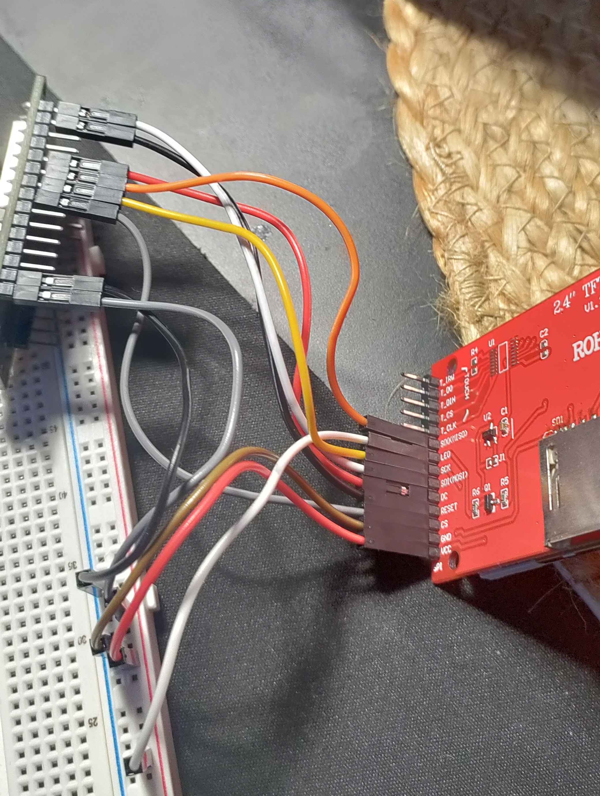

# TFT ST7789 Wifi Text
Example project using ST7789 TFT screen with an ESP32 MCU to change the text on the screen based on a HTTP request. Used for reference on basic TFT screen wiring and hosting a HTTP webserver on ESP32.

## Parts Used

- ESP32 DevkitC, 3.3V Output
- 2.4" ST7789 TFT Screen, 3.3V Input
- Breadboard and jumper cables

## Wiring and Flashing

### SPI and GPIO Pins
The TFT screen uses a SPI interface, and on ESP32 2 are provided for external use - referred to as VSPI and HSPI.

Each SPI interface requires using 4 specific pins on the ESP32, in this example I'm using VSPI which corresponds to these GPIO pins (See [ESP32 SPI Communication](https://randomnerdtutorials.com/esp32-spi-communication-arduino/)):

```
MOSI	MISO	SCLK	CS
23	  19	  18	  5
```

As well as this connect DC and RST to any available GPIO pins, in this case in the `platformio.ini` I'm using DC=21 and RST=22.

### 3.3V and GND
The TFT screen requires 2 3.3V inputs to its pins, so a method of providing this is to use a breadboard and from ESP32 connect 3.3V and GND to the power-rail.

Now from the TFT screen connect the VCC pin to the positive power-rail, GND to negative, and the LED pin to positive. With this connection made if you power the ESP32 now you should see a backlight come on the TFT screen indicating that power is successfully provided, without needing to flash any code.

An example image of how this wiring can look:



### Flashing
Use Platformio to flash firmware to the ESP32. Modify `main.cpp` and `platformio.ini` for any firmware changes:

```
cd tft_st7789_wifi_text && pio run -t upload
```

## Writing Text Over WiFi
The screen when started up will default to "Some Text" as that is called in `setup` to the `header` function. To update the text you make a curl request with URL encoded data to the static IP of the ESP32 if it successfully connected to the WiFi network:

```
curl "http://192.168.1.45:80/data?headerValue=Text%20sent%20over%20WiFi%20to%20the%20ESP32"
```


